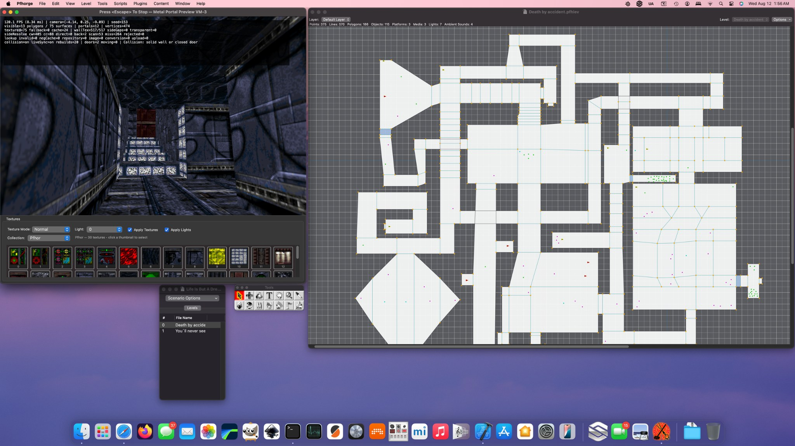
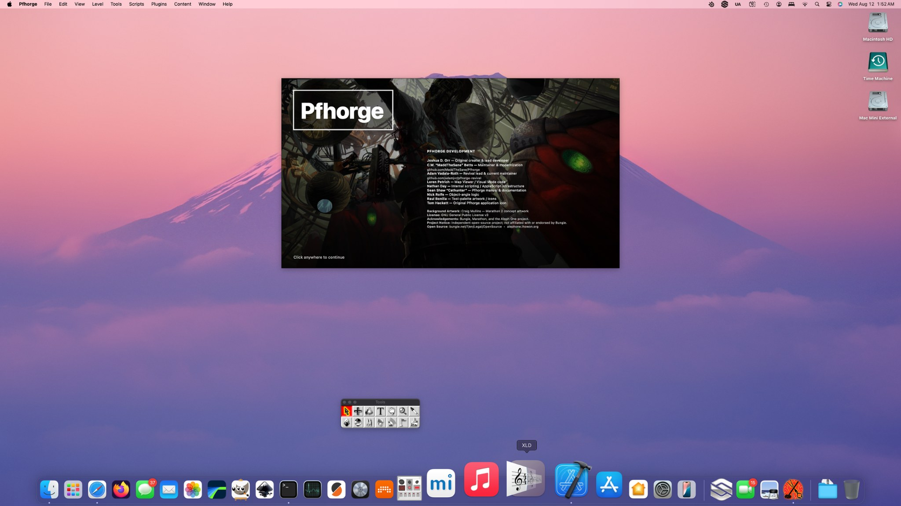
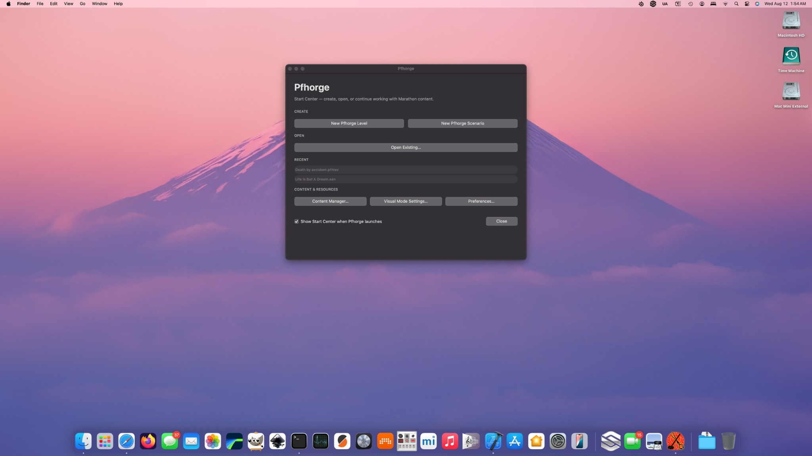
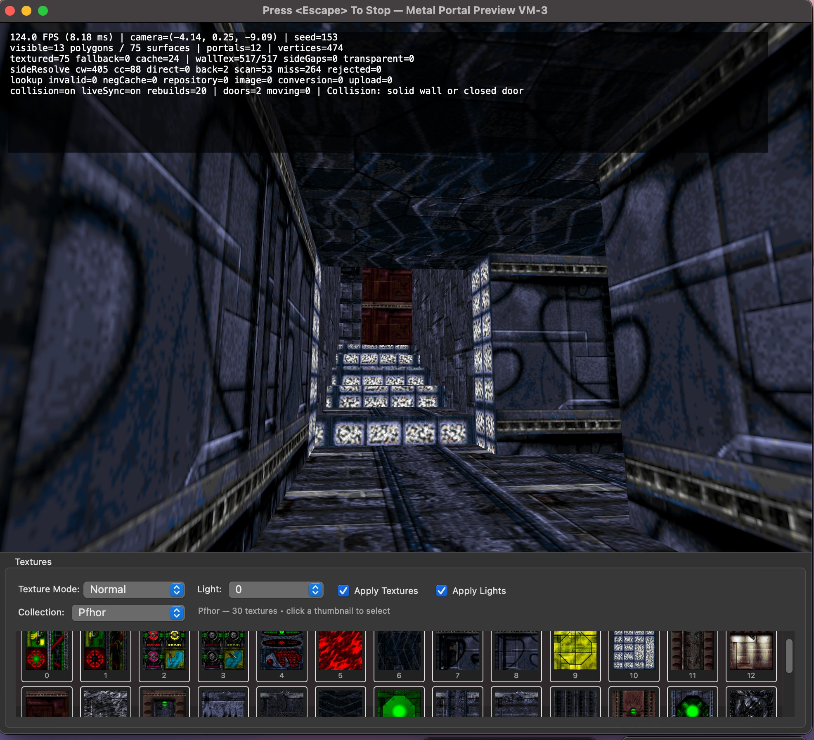
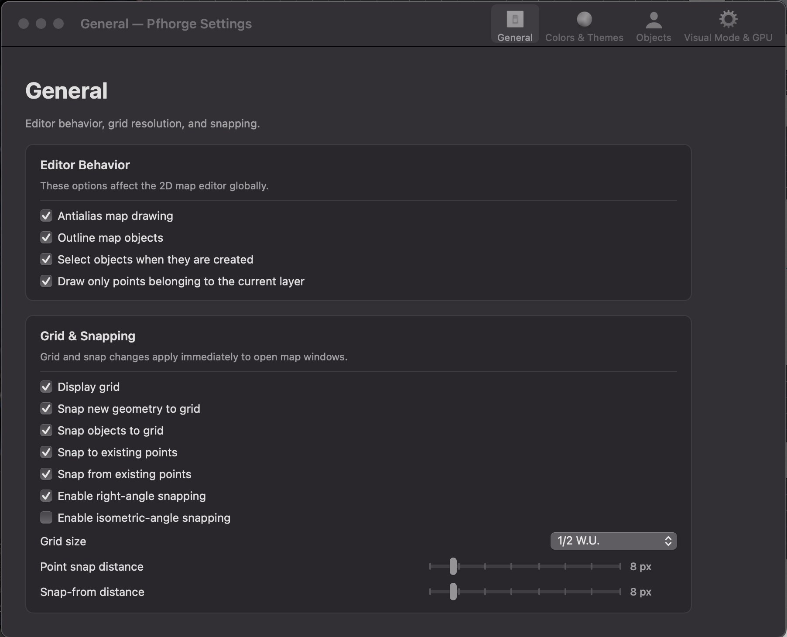
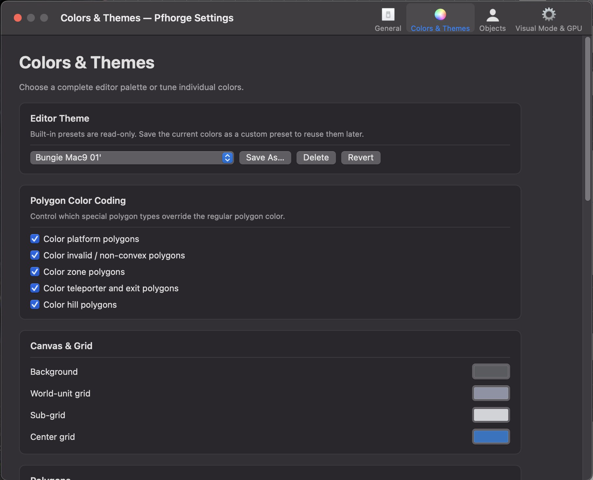
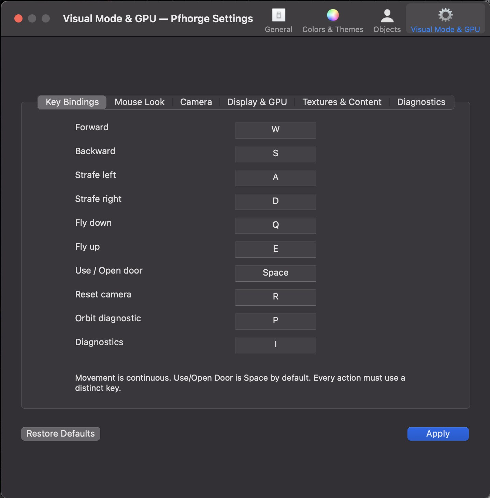
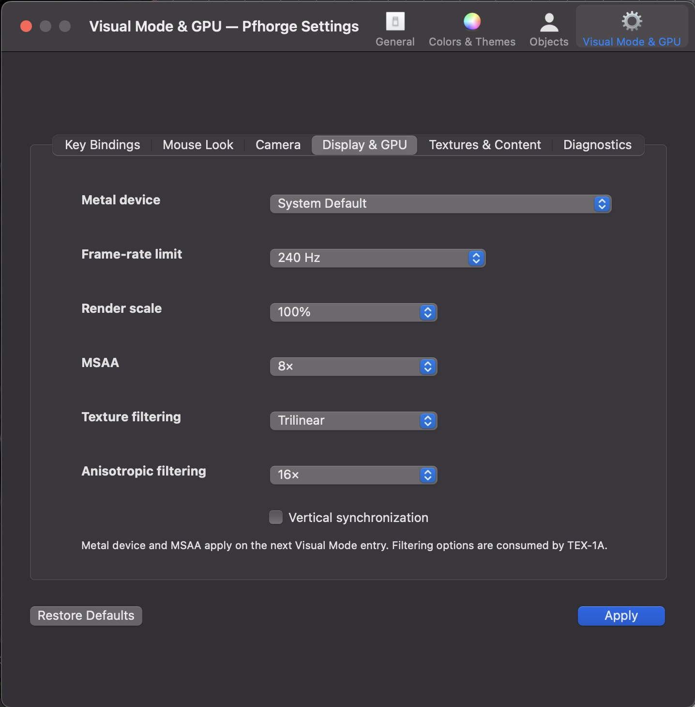

# Pfhorge Revival

**Pfhorge Revival** is an active continuation of **Pfhorge**, the native macOS
map editor for classic Marathon and Aleph One.

The project is no longer just a compatibility build. The current `main` branch
runs natively on modern Apple Silicon macOS and now includes a revived Metal
Visual Mode, classic Shapes texture rendering, a Forge-inspired texture
workspace, modern application startup, a unified settings system, content
management, high-refresh display controls, and ongoing work toward reliable
3D surface editing.



## What works today

### Native modern macOS application

Pfhorge builds and launches as a native AppKit application on current macOS and
Apple Silicon. The revival keeps the original editor model and file semantics
while replacing dead or obsolete platform assumptions incrementally.

The application now has:

- a persistent startup splash and contributor screen
- a native Start Center for creating, opening, and reopening projects
- unified application preferences
- persistent editor themes and color palettes
- object visibility controls
- first-class Content and Visual Mode settings
- current Xcode build support and revival validation tooling



The splash doubles as a compact project identity and contributor screen, keeping
the revival's lineage visible instead of hiding it behind an About box.



### Revived Metal Visual Mode

The new Visual Mode is a native `MTKView` renderer embedded directly into the
existing AppKit application. It uses a renderer-neutral preview scene and
Marathon-aware portal traversal rather than treating a level as a generic
whole-map mesh.

Current Visual Mode functionality includes:

- first-person navigation
- continuous keyboard movement
- collision-aware movement
- Use/Open Door interaction
- saved-player-start camera placement
- portal-filtered visibility
- floor, ceiling, and wall rendering
- classic Marathon Shapes texture decoding and Metal upload
- configurable texture filtering and anisotropy
- configurable render scale, MSAA, frame-rate limit, and VSync
- live synchronization from unsaved editor data
- diagnostic overlays and whole-scene orbit mode
- level-environment-aware texture collections
- a Forge-inspired texture palette attached directly below the 3D viewport



The current regression level, **Death by accident**, exposed a legacy topology
problem where empty archived polygon adjacency arrays could alias transparent
portal edges to polygon zero. The preview now resolves portal neighbors from
the line-owned clockwise/counterclockwise polygon relationships. Runtime testing
confirmed that this repair removed the invisible collision walls that had been
blocking movement through otherwise valid portals.

### Forge-style texture workspace

Visual Mode now carries a native AppKit texture workspace in the same window as
the Metal renderer. It reads real classic textures from the same
`TextureRepository` used elsewhere in Pfhorge.

The current workspace provides:

- Water, Lava, Sewage, Jjaro, Pfhor, and Landscape collections
- clickable real Shapes texture thumbnails
- bitmap selection state
- transfer-mode selection
- light selection
- Apply Textures / Apply Lights state
- persistent window positioning and sizing

This is currently a **selection and inspection foundation**. Clicking the 3D
view does not yet mutate map surfaces; reliable surface picking and undoable
painting come after the remaining renderer-fidelity work.

### Modern settings without abandoning AppKit

The old scattered preference experience is being consolidated into a native
settings window while preserving Pfhorge's existing editor behavior.





The Visual Mode settings expose the controls that the Metal renderer actually
consumes, including key bindings and high-refresh GPU/display options.





## Current engineering focus

The renderer is now useful enough that the remaining defects are specific and
measurable instead of being buried under basic navigation failures.

The immediate work is:

1. account for wall surfaces that still reach Metal without a valid side/texture
   descriptor
2. implement Marathon-correct Landscape/sky rendering instead of stretching a
   landscape bitmap across each wall segment
3. make Metal transfer modes and lighting evaluate real Marathon semantics
4. add reliable surface picking with stable polygon/line/side/layer provenance
5. connect the existing texture palette to undoable wall/floor/ceiling editing

The goal is not merely to make the preview look plausible. Visual Mode has to
be trustworthy enough that clicking a surface means Pfhorge knows **exactly**
which Marathon map field will be edited.

See the detailed roadmaps:

- [`docs/revival/PFHORGE-REVIVAL-ROADMAP.md`](docs/revival/PFHORGE-REVIVAL-ROADMAP.md)
- [`docs/revival/VISUAL-MODE-ROADMAP.md`](docs/revival/VISUAL-MODE-ROADMAP.md)
- [`docs/revival/SCREENSHOTS.md`](docs/revival/SCREENSHOTS.md)
- [`docs/revival/ALEPH-ONE-INTEGRATION.md`](docs/revival/ALEPH-ONE-INTEGRATION.md)
- [`docs/revival/FORGE-PARITY-MATRIX.md`](docs/revival/FORGE-PARITY-MATRIX.md)
- [`docs/revival/LICENSE-POLICY.md`](docs/revival/LICENSE-POLICY.md)

## Architecture

The revived Visual Mode does **not** embed the complete Aleph One game. Pfhorge
owns editing and document state; the preview layer translates that state into
renderer-neutral Marathon geometry and semantics.

```text
Pfhorge mutable editor model
        |
        v
Immutable PreviewScene snapshot
        |
        +--> topology / side ownership
        +--> portal visibility
        +--> texture descriptors
        +--> platform state
        +--> diagnostics
        |
        v
PreviewFrame
        |
        +----> Metal backend on macOS
        |
        `----> Vulkan backend later
```

OpenGL remains a historical/reference path. New production renderer work targets
Metal first because Pfhorge is still a native macOS AppKit editor.

## Map and content work

The revival also contains the foundation for universal Marathon-family map
intake and distribution-aware content management:

- raw Marathon containers
- AppleSingle and AppleDouble
- MacBinary
- native resource-fork intake
- merged scenario inspection and selectable level import
- source provenance and import reporting
- original Shapes discovery and selection
- official trilogy content recipes
- use-in-place or Pfhorge-managed content
- texture profile infrastructure
- explicit validation and diagnostic reporting

Historical input is treated as source material. Import creates native Pfhorge
documents rather than silently overwriting original files.

## Build

Pfhorge requires macOS and a full Xcode installation.

```bash
./scripts/revival/bootstrap_macos.sh --no-branch
```

Useful validation targets:

```bash
make -f revival.mk audit
make -f revival.mk baseline
make -f revival.mk stage1
make -f revival.mk preview-core-check
```

Generated reports are written to `RevivalArtifacts/` and are intentionally
ignored by Git.

## Development branches

The repository intentionally keeps the branch model simple:

```text
main
    current accepted Pfhorge Revival development

experimental
    risky renderer, importer, and architecture experiments
```

Normal development lands on `main`. `experimental` exists for work that is
deliberately allowed to break assumptions.

## Screenshots

The August 2026 development gallery shows the current splash, Start Center,
2D editor, theme/preferences work, Visual Mode settings, and Metal renderer:

**[View the full development screenshot gallery.](docs/revival/SCREENSHOTS.md)**

> Development artwork note: the splash-screen background shown in these
> screenshots is part of the current development build. Rights/redistribution
> review for that background artwork must be completed before treating it as a
> final distributable project asset.

## Source provenance

Pfhorge was created by **Joshua D. Orr** and subsequently maintained and
modernized by other contributors. Preserve inherited copyright and license
notices. See [`NOTICE.md`](NOTICE.md).

## License

Pfhorge Revival is distributed under the **GNU General Public License,
version 3 or later**.

SPDX identifier: `GPL-3.0-or-later`

See [`LICENSE`](LICENSE).
