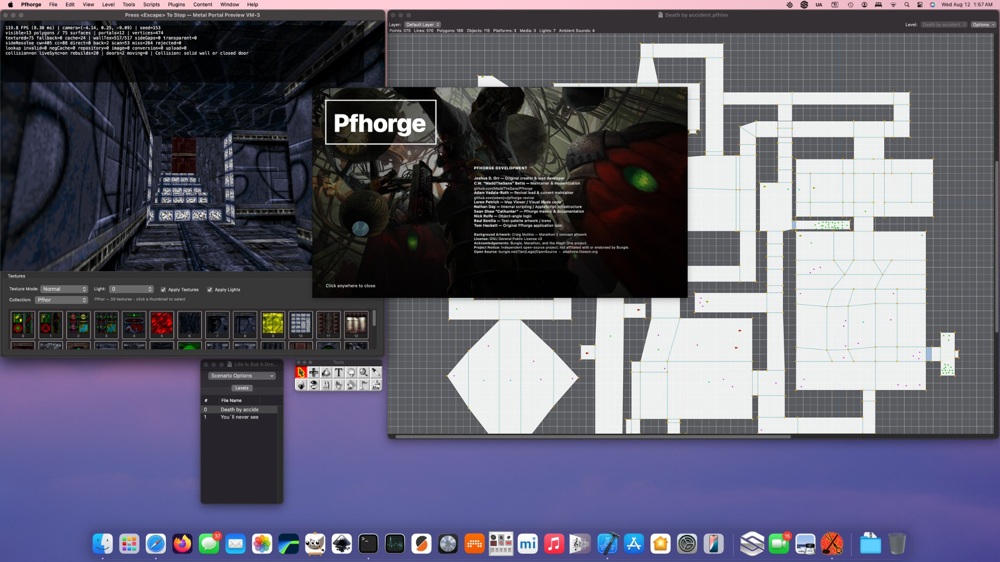
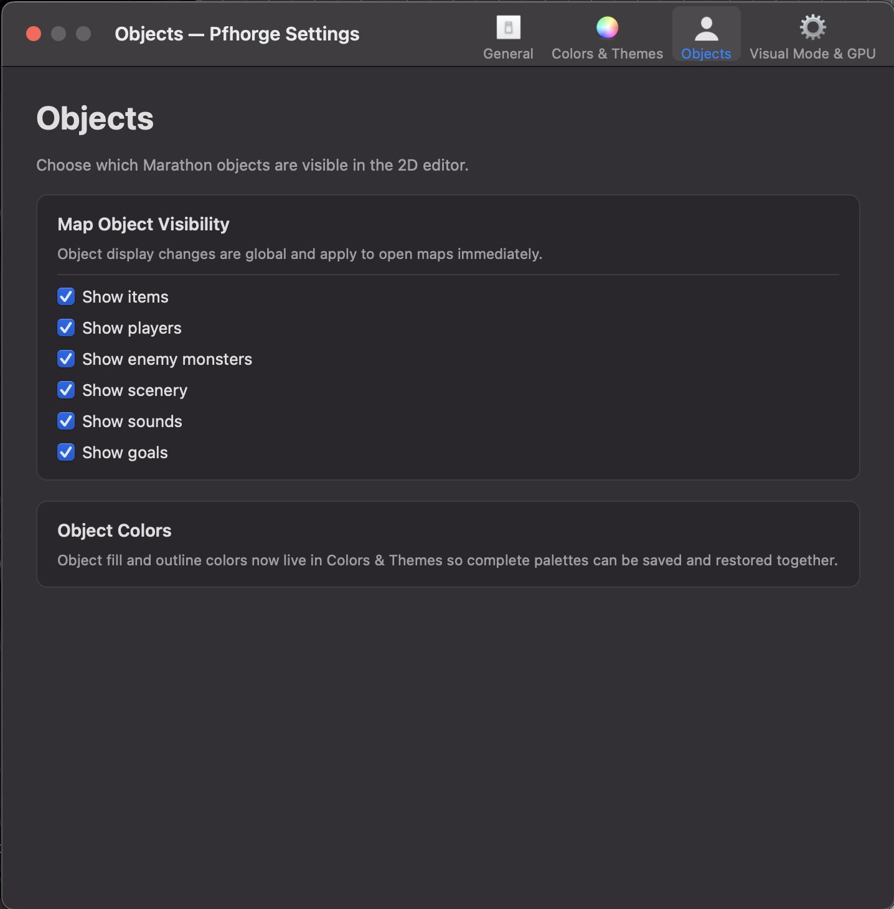
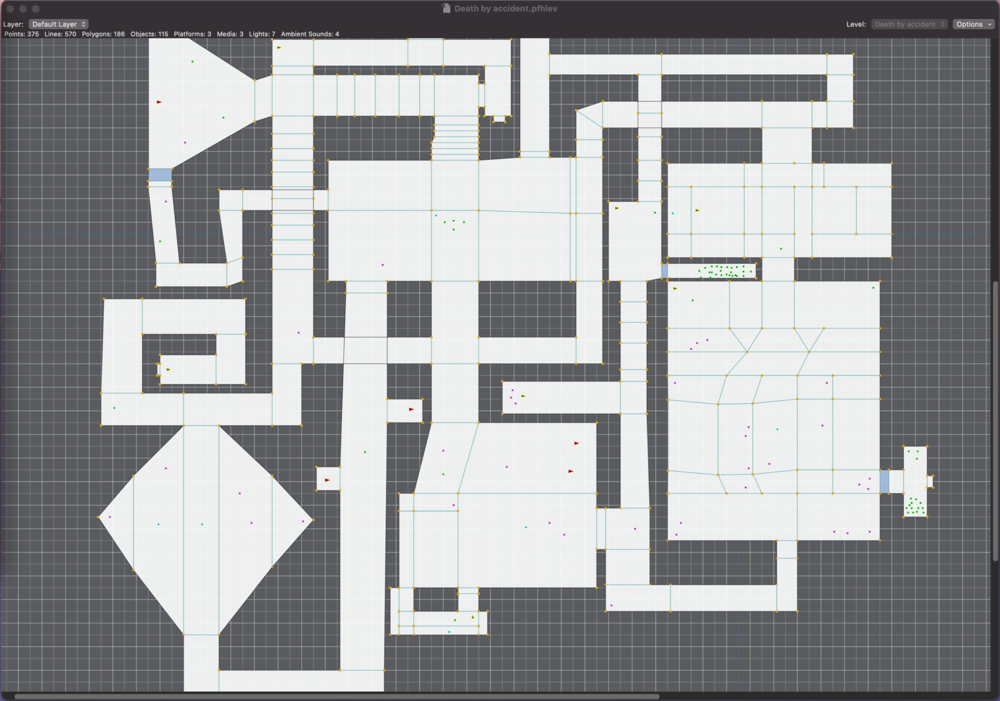

# Pfhorge Revival — Development Screenshots

These screenshots capture the current `main` development state on macOS in
August 2026.

They are not static mockups. They show the native application, current 2D
editor, the revived Metal Visual Mode, the Forge-style texture workspace, and
the modernized settings UI running together.

> **Development artwork note:** the splash-screen background shown below is
> part of the current development build. Rights/redistribution review for that
> background artwork must be completed before it is treated as a final
> distributable project asset.

## Startup splash

The revived startup presents project identity and contributor/provenance
information before handing off to the editor.

## Start Center

The Start Center provides native create/open/recent workflows plus direct entry
to Content, Visual Mode, and general settings.

## Full editor + Metal Visual Mode

This is the current working development setup: the original-style 2D map editor
alongside the revived Metal renderer and its attached texture workspace.

## Splash over a live editor session

The splash/about presentation is reusable after launch and does not replace the
underlying document/editor session.

## General settings

General editor behavior, grid display, snapping, grid resolution, and point
snap distances are grouped into a single modern native settings page.

## Colors & Themes

Complete editor palettes can be selected, customized, saved, reverted, and
applied to polygon, canvas, grid, and object visualization.

## Object visibility

Object visibility is explicit and global for the 2D editor, while object colors
remain part of complete reusable editor themes.

## Visual Mode key bindings

Metal Visual Mode consumes persistent rebindable controls rather than relying on
hard-coded movement keys.

## Visual Mode display & GPU

Current renderer controls include Metal device selection, frame-rate limit,
render scale, MSAA, texture filtering, anisotropic filtering, and VSync.

## Forge-style texture workspace

The Metal viewport and native AppKit texture palette now share a single Visual
Mode window. The palette displays real classic Shapes textures and publishes
selection state for the upcoming surface-picking/editing work.

## 2D editor — Death by accident

`Death by accident` is the current Visual Mode regression level. It exposed the
portal-adjacency bug that produced invisible collision walls and is now being
used to investigate remaining wall-surface and landscape rendering fidelity.
